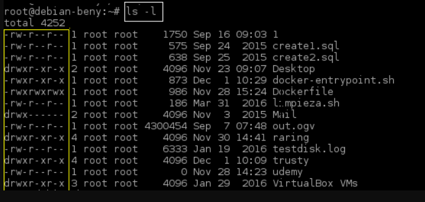
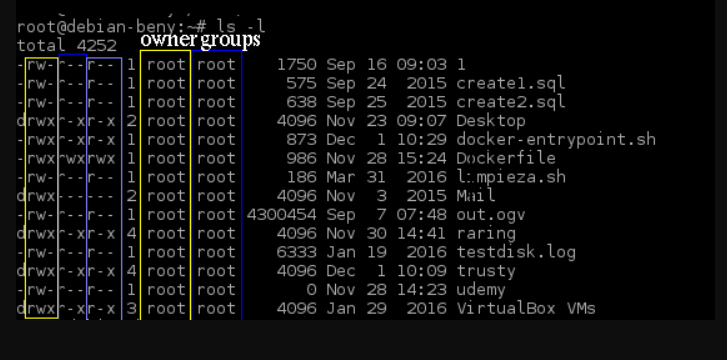
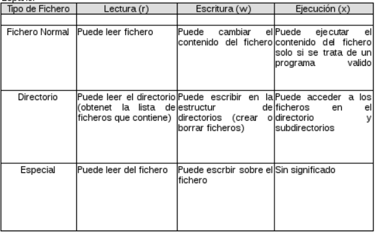
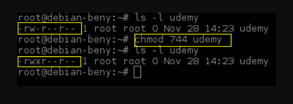

- Permisos y privilegios Linux

El propietario del fichero puede definir quien ingresa a cierto fichero y de que forma. 
Mientras que el usuario root o superusuario tendra todos permisos de acceso sobre los ficheros.Para conocer quien tiene permisos sobre un fichero, es necesario fijarse en la primera columna de la salida del comando ls -l.

Si es un guión (-) significa que es un archivo, sí es una (d) significa que es un directorio, los siguientes nueve caracteres definen los permisos del fichero.

El primer grupo define los permisos que se aplicaran cuando acceda el propietario del fichero (indicando en la tercera columna del comando ls -l)
El segundo grupo define los permisos que se aplicaran para los usuarios que pertenezcan al grupo propietario del fichero (indicado en la cuarta columna del comando ls -l).
El tercer grupo define los permisos que se aplicaran para el resto de los usuarios, es decir usuarios que no son ni propietarios del fichero ni pertenecen a ningún grupo. En palabras más sencillas estos se definen en Owner, Grupos y otros como muestro en la siguiente imagen.

*Los recuadros de color amarillo son los representados por el owner, con el color azul tenemos a los grupos y con el morado tenermos a otros.*

Estos permisos quieren decir lo siguiente

r = read y es representado por el número 4

w = write y es representado por el numero 2

x = execute y es representado por el numero 1

En el siguiente recuadro se muestra la explicación de estos permisos.

- chmod

Si desemos cambiar los permisos a un archivo en especifico lo podemos hacer de la siguiente manera:

chmod 760 nombre del archivo

En la pantalla muestro un ejemplo con uno de mis archivos

Como pueden observar utilice el comando chmod y la combinacion de numeros para darle al archivo udemy, permisos para ser ejecutado por el usuario root, ya que no los tenia anteriormente, y esto puede ser tambien con el grupo y con otros usuarios del sistema.